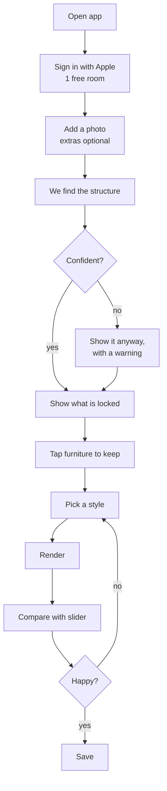
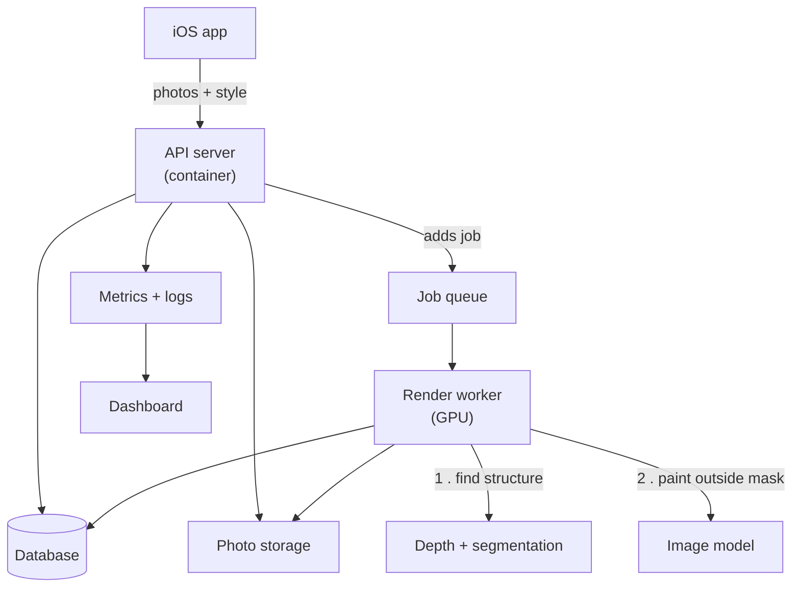
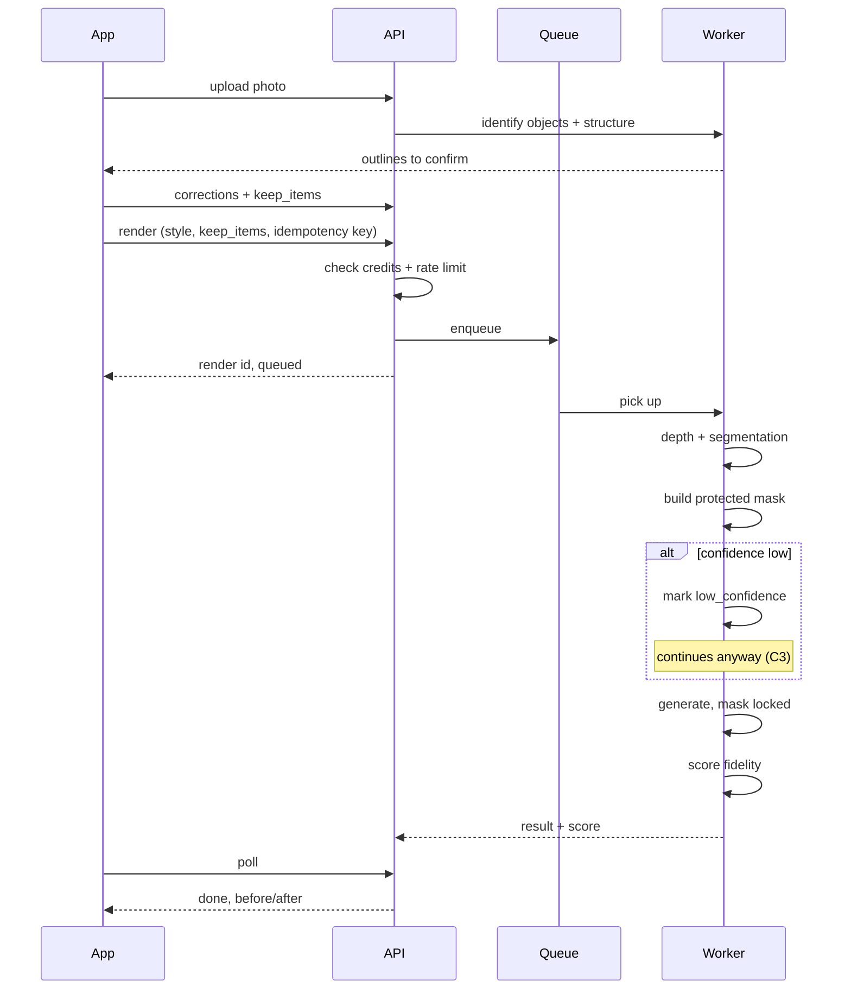
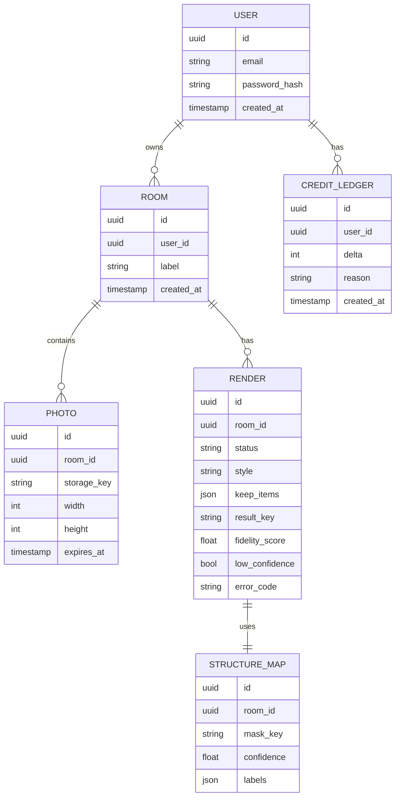
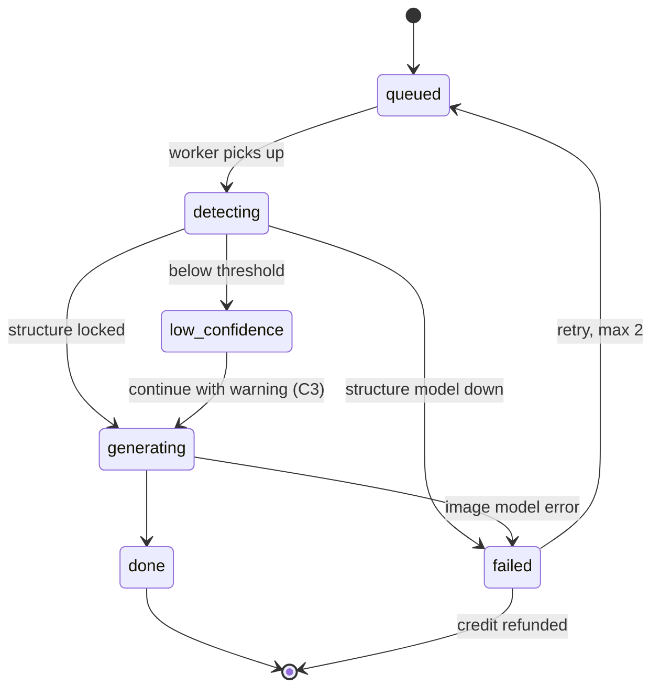
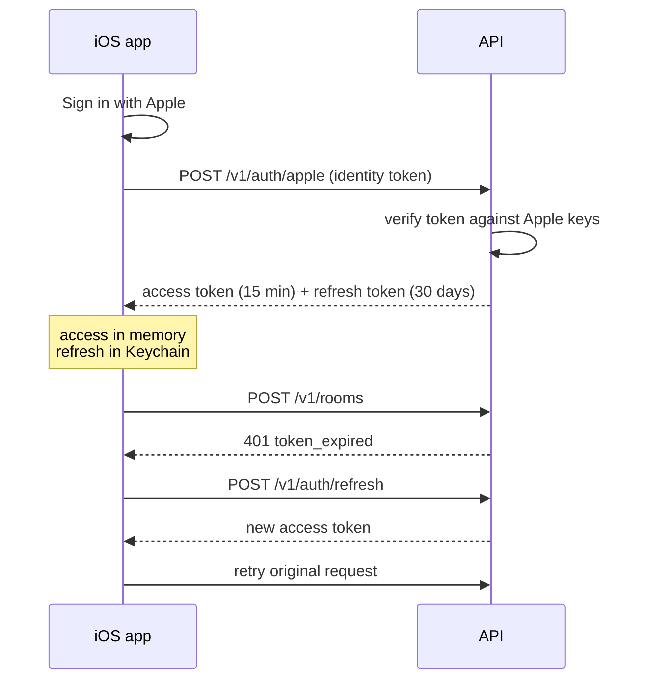
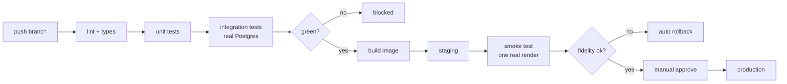

# PRD — app_1

Generated 2026-09-09 from `spec/index.html` and `spec/state.json`.
10 review rounds · 42 decisions recorded · 23 decision points in the document.

> Generated file — do not edit by hand. Change the page or the decisions and re-run
> `python3 spec/build_prd.py`. Evidence: `research/home-decorating.md`.

---

# The case

## 1. Summary

An iOS app that restyles a photo of your room without changing the room. You send one photo — more if you want a better result — we work out where the walls, windows, doors and floor are and lock their positions, and only then do we let an image model repaint what is left. Colour, finish and furnishings are free to change; the shape of the room is not. You get a before and after view so you can check for yourself.

Every competing app in this category redraws the room. That is the single most repeated complaint about all of them, and it is the only thing this product is trying to fix.

## 2. The problem

*Found in 63 verbatim complaints from 45 people. Full evidence in `research/home-decorating.md`.*

People photograph their living room, ask an AI app to restyle it, and get back a different room — new windows, moved walls, furniture they never owned. Seven separate reviewers across four different apps describe the same failure.

> "The app advertises that you can take a photo of a room and have it rearrange the furniture and items into a new design. Unfortunately, that is not how the app actually works." — 1neVerkn0ws

> "adds addition windows and doors, changes room configuration and does not use your existing room" — LiaGator

> "it still gives me an image of whole new furnitures and it restructures my whole house, nothing like i asked for." — balls242

> "does what it wants, changes your photos to what it wants even when you give direction" — loveulo13

This is a quality failure, not a business-model failure. People want what is being sold. It does not work.

## 3. What the evidence demands

*Constraints the research forces on any solution, written before we design one. Everything after this section has to satisfy these.*

| # | Requirement | Because |
| --- | --- | --- |
| **R1** | The result must contain the user's actual room. Geometry cannot move — walls, openings, proportions. | The complaint, stated seven times. |
| **R2** | The user must be able to check that themselves, not take our word for it. | Every competitor claims to respect your room. Claims are worthless here; only proof separates us. |
| **R3** | It must work from a single photo an ordinary person can take on a phone they already own. | Requiring a scan or special hardware shrinks the audience to people who already have options. |
| **R4** | Someone must be able to see it work before paying. | "They want to charge you before the you're able to determine at all whether what the app offers is worth anything" — Isabella_belli |
| **R5** | When the system is unsure, it must say so rather than quietly guessing. | A silent wrong answer is exactly the failure we exist to fix. |
| **R6** | Furniture people already own must be able to stay. | "does not use your existing room" is about contents as much as walls. |

> **Use these as the test.** Any decision later in this document that breaks one of these six is either wrong, or is a risk we are taking deliberately and writing down.

## 4. Positioning locked

*Settled at stage 2. Everything below obeys this.*

**It's basically DecorAI or Interium, but it never invents architecture.** The flow is the one the category already taught people — upload a photo, get design options back — but the room's structure is extracted and locked before anything is generated, and the user can see what is being protected.

The wedge is credibility, not features. We are not trying to have more styles or a nicer gallery. We are trying to be the one that gives you back your own room.

## 5. Who it's for

Someone who has just moved in, and who brought furniture from their last place that does not suit the new one. They have rooms they do not like, things they are not willing to throw away, and no method for reconciling the two.

This was decided in round 3 (D1 with C1). It matters because it sets what "keep my furniture" means: not a lifetime of accumulated things, but a specific sofa and bookshelf that have to work somewhere.

## 6. What it does, and what it does not

### Does

Takes one photo of one room. Outlines everything it can see, and asks the user to confirm and mark what they want removed. Finds the structure. Locks it. Restyles everything else in a chosen direction, keeping any furniture the user taps. Shows the result beside the original so it can be checked. One free room, three restyles.

### Does not — v1 exclusions

- Shopping links or buyable products
- AR or live camera preview
- Floor plans and 3D walkthroughs
- A human designer marketplace
- Social feed, sharing or challenges
- Multi-room projects
- Collaboration with a partner or spouse

> **Every one of these is defensible on its own.** That is exactly why they are written down. The apps in this category that failed did not fail from missing features.

---

# The experience

## 7. How someone gets through it

*Six screens. Screen 2 is the one no competitor has.*



The loop that matters is **style → render → compare → style again**. D14 gives three restyles per room, which is enough to go round it twice and still keep the one you liked.

## 8. The screens

*Click through them. Where there is a real layout choice, pick one — it records as a decision.*

**Sign up**

- Account first, per D13.
- One free room granted at signup, written to the credit ledger.
- This screen is where R4 is at risk — nobody has seen it work yet.

**Add a photo**

- One photo required, and we do not ask for more (U1: silent).
- Framing instruction is the mitigation — the photo must cover everything we are expected to protect.
- A room with no photo returns no_photos.
- Over 12 MB returns photo_too_large.
- Cost: a single photo makes depth estimation materially harder. See C4.

**Structure found**

- The screen no competitor has. R2 — and after round 7 it does more work than that.
- The user is now the validator: detection has to be checkable, not perfect.
- D10b set the scope: geometry only. Where things are is locked; what they look like is free.
- U2 decides how the protected area is drawn.

**Low confidence**

- This is C3, the accepted risk, on screen.
- D11 chose to proceed with a warning rather than block.
- It breaks R5 in spirit: we are unsure, we say so, and we continue anyway.
- If C3 is ever revisited, this screen becomes the fix.

**Keep furniture**

- D4 and R6. Tapped items go into keep_items on the render request.
- Matters because C1 defined the user as a new mover carrying old furniture.

**Pick a style**

- D5 chose presets plus optional words. U4 chose image cards.
- Samples are stock images, not previews of your room (round 5). They cost nothing per user and add no wait.
- Free text goes to the model but can never unlock the mask.
- Costs one credit per room, three restyles included (D14).

**Rendering**

- Queued job. Client learns of completion per T4.
- If the image model dies here: two retries, then render_failed and the credit comes back.

**Compare**

- Where the promise is proven. R2, D3 and U3.
- The fidelity score is shown, not hidden — it is the number on the dashboard too.
- Restyle returns to the style screen. That loop is where people decide they like this.

**U1 — One photo is required. Do we ask for more?**

*Round 5 dropped the 2-3 photo requirement. Extra photos still improve structure detection, so the question is how hard we push.*

**→** **Do not ask** — One photo, straight through. Lowest friction, weakest geometry.
  · Offer, do not require — "Add another for a better result." Most people skip it; those who care get a better render.
  · Only ask when confidence is low — Silent when it works, asks exactly when an extra photo would help. Most work to build.

**U2 — How do we draw what is locked?**

*This is R2 made visual. It is the most important image in the app.*

  · Tinted fill over protected areas — Unmistakable. Can obscure the room underneath.
**→** **Outline only** — You still see your room. Subtler, and easier to misread on a busy photo.
  · Dim everything that will change — Inverts it — highlights what we are free to touch. Arguably the more honest framing.

**U3 — How is the before/after shown?**

*D3 chose a slider. This is how it sits on a phone.*

  · Full-width slider — Biggest image, most dramatic. Fidelity score sits underneath.
**→** **Stacked before and after** — Both visible at once, no interaction needed. Each image is smaller.

**U4 — How are styles chosen?**

*D5 chose presets plus optional words.*

**→** **Scrollable image cards** — Generic sample photos per style, produced once. Not rendered from the user's room — nobody waits.
  · Text chips — Fast, compact, no assets to produce. Less persuasive.

## 9. How we know it worked

The headline metric is **preservation rate** — of the architectural items the inventory found, how many are still present and in the same place in the result.

> **How it is measured:** a vision call compares the two images against the inventory list and answers, item by item, present or not. Not a pixel comparison — the spike showed output is never aligned with input, so arithmetic is impossible. It is a judgement, made by a model, on a list we already have.

> **Why not pixel similarity:** it would punish a successful repaint, and it cannot run at all on a reframed image.

It is the right metric because it measures the promise directly rather than a proxy for it. If fidelity is high and nobody comes back, the idea was wrong. If fidelity is low, the execution is wrong. Most metrics cannot tell you which.

> **Watch the 5th percentile, not the average.** An average of 0.94 hides the one render in twenty that came back as somebody else's room — and that render is the one that gets screenshotted into a review.

## 10. Risks we are taking on purpose

> [!WARNING]
> **The fidelity chain (C3).** D10 makes the widest promise available — walls, windows, doors, ceiling, built-ins, flooring and light fixtures. D12 supplies the weakest input, freeform photos. D11 renders anyway when confidence is low. Taken together this breaks **R5**. The failure is concrete: bad photos in, uncertain detection, a render ships with a small warning, and someone receives a room with a window that is not theirs — the exact complaint this product exists to fix, now with a disclaimer attached.Accepted deliberately in round 4 as the fastest route to shipping. The mitigation is that fidelity is the headline metric, so the cost lands on the dashboard instead of hiding. Revisit once there is real data.

> **Updated 2026-09-09 after the spike.** Three of the risks below were bets on whether an approximate mask would hold up. There is no mask any more, so they resolve differently than expected — two shrink, one is disproven outright.

> [!WARNING]
> **T11 — disproven, not accepted.** The plan was to trust the model's mask. Testing showed the mask does not preserve anything: the region marked for protection was deleted, and measured pixel change inside it was *higher* than outside. Compositing the original back is equally unavailable, since output is never aligned with input. The mask is gone from the architecture entirely.

> [!WARNING]
> **C3 and C4 — substantially reduced.** Both were about a wide promise resting on weak input and a permissive failure path. With architecture named explicitly in the prompt, a single photo proved sufficient on a genuinely hard room. The residual risk is no longer "will the mask hold" but "will the inventory list everything" — which is what T14 addresses, and which the user can see and correct.

> [!WARNING]
> **New — the camera moves.** Output framing shifts slightly from input; the crop tightens. Everything stays correct relative to everything else. Consequences: no wipe-slider comparison (U3's stacked layout already avoids this), and preservation must be judged by a vision call rather than computed. Not fixable by prompt; it follows from the API's fixed output sizes.

**C4 — Which lever moves to pay for the single photo?**

  · Narrow the promise (D10) — Protect walls, windows, doors and ceiling. Drop flooring and fixtures, which are the hardest to hold from one angle and the least noticed when they shift.
  · Ask for a second photo only when unsure (U1) — Keeps one photo as the normal path and buys accuracy exactly where it is missing. Costs nothing to the people it does not affect.
  · Let people fix the detection (D11) — Show the guess, let them drag the walls right. Turns the weak moment into the trust moment.
**→** **Accept it, again** — Ship the loosest configuration and let the fidelity metric report the damage. Fastest, and consistent with C3.

> [!WARNING]
> **T11 — the mask is not enforced.** T10 chose OpenAI, whose mask is documented as "followed loosely" over a whole-image recreation. T11 chose to trust it rather than paste the original pixels back afterwards. The product's central promise therefore has no mechanism behind it beyond the vendor's best effort and the user's confirmation at the outline step. Decided in round 7 with the limitation known. Compositing remains available later at roughly twenty lines of code, and would convert the promise from hoped-for to guaranteed without changing any other decision.

> [!WARNING]
> **T14 — a wrong inventory is accepted.** The inventory is now the only thing protecting the room; there is no mask behind it. Anything it fails to list is silently unprotected, and the user is not asked to add what is missing. It listed all 13 items correctly on our test photo. Chosen in round 10 for speed. The cheap fix later is one line on the confirm screen — "anything we missed?" — which would turn that screen into a real check.

> [!WARNING]
> **F3 — no CI/CD for the client.** The app is built locally. The series baseline in CLAUDE.md requires CI/CD, so this is a deliberate hole in the thing the series exists to demonstrate. The backend keeps its full pipeline; only the iOS half is exempt. Revisit before any release that is not to your own device.

> [!WARNING]
> **F5 — unit tests only on the client.** Snapshot tests were declined. Those are the ones that catch the outline overlay being drawn in the wrong place on the confirm screen — a failure no unit test can see, on the screen the product depends on.

> [!WARNING]
> **Account before first render (D13).** Sits against **R4**, though round 5 softened it considerably: Sign in with Apple is one tap with no password and no email handed over. The friction is now small enough that this is close to retired as a risk.

---

# The build

## 11. Technical requirements

*What the system must do, before any decision about how. These come from the six product requirements above plus the series baseline.*

| # | Requirement | From |
| --- | --- | --- |
| **TR1** | A render finishes in under 60 seconds at the 95th percentile. | People stare at a phone while it works. |
| **TR2** | Cost per render is low enough that 1 free room × 3 restyles is affordable at 10,000 users. | R4 — free proof before payment. |
| **TR3** | Structure detection must emit a numeric confidence, not just a result. | R5 and D11 are impossible without it. |
| **TR4** | Photos are deletable on request, never written to logs, never sent anywhere not listed here. | These are pictures of where people live. |
| **TR5** | Any dependency can fail without corrupting state or charging a user for nothing. | Series baseline: deliberate failure handling. |
| **TR6** | The whole system runs on one laptop with `docker compose up`. | Series baseline: local deploy first. |
| **TR7** | Structure fidelity is measurable automatically on every render. | It is the success metric; it cannot be hand-scored. |

## 12. How the system is built

> **In plain words:** the phone talks to one server. That server is deliberately dull — it writes to a database and drops slow work into a waiting line. A separate machine with a graphics card takes work off the line and does the heavy lifting.



The API never generates images. That split is why the API can stay small, start fast, and be run as several copies behind a load balancer while exactly one expensive GPU machine does the slow work.

### What happens on render



### How we keep the room

*Validated by experiment on 2026-09-09. See "What the spike proved" below.*

Competitors hand the whole photo to an image model and ask for a redesign. The model redraws everything, walls included, because nothing told it what was in the room. We do two calls instead of one:

1. **Inventory** — a vision call lists everything in the photo: fixed architecture (fireplace, mantel, alcove, ceiling step, flooring, switches, walls) and moveable objects (lamp, TV, cabinet, decor). Each gets a letter and two texts: a short name for the user, and a precise positional description for the image model.
2. **Confirm** — the user sees the letters on their photo and taps whatever they want removed. Everything else stays by default.
3. **Generate** — one image call whose prompt names every architectural item verbatim under "must remain exactly where they are", the kept objects under "keep, in the same positions", and the tapped ones under "remove entirely".

> **Why it works:** the model does not fail from unwillingness, it fails from not knowing what is in the picture. Naming *"deep rectangular wall alcove centred above and to the right of the fireplace"* is enough. Naming nothing is not.

> [!WARNING]
> **What it does not fix.** The camera framing still shifts slightly between input and output. Everything stays in the right place relative to everything else, but the crop tightens. No prompt wording has fixed this, and it is a property of the API's fixed output sizes.

**D10b — Reopening D10: what does "structure" protect?**

*D10 currently protects walls, windows, doors, ceiling, built-ins, flooring and light fixtures. If all of that is locked, a theme can only swap furniture — the same beige room with a different sofa. The complaints we found were about walls being moved and windows being invented, never about repainting.*

**→** **Geometry only** — Lock where things are: wall positions, window and door openings, ceiling line, room proportions, floor plane. Colour, finish, textiles and fixtures are all fair game. Sharper promise, better results, more forgiving mask.
  · Geometry plus built-ins — As above, but fireplaces, cabinetry and radiators keep their form too. Their surfaces can still change.
  · Keep D10 as it is — Everything architectural stays exactly as photographed. Safest promise, and the restyle is furniture-only.

**T7 — How do we find the structure? superseded**

*Answered by the spike instead: structure is found by the vision inventory call, not by depth and segmentation models. Kept for the record; the options below are no longer live.*

**→** **Depth model + segmentation model** — Best accuracy, two models to run, slowest and priciest per render.
  · Segmentation only — One model. Good on walls and windows, weak on flooring — which D10 promised.
  · A hosted vision API — Nothing to run. Ties the core mechanism to a vendor and a per-call bill.

**T1 — Where does image generation run?**

*Biggest cost and quality decision in the app. TR2 depends on it.*

**→** **A hosted image API** — Pennies per image, no GPU to manage, ships in days. Exposed to their pricing and their filters, and masked generation must be supported.
  · Self-hosted on a rented GPU — Full control of masking, much better video, a fixed monthly bill whether or not anyone uses it.
  · Hosted now, self-hosted later — Ship first, move when the bill justifies it. Only works if the code never learns which is behind it.

**T10 — Which model, specifically?**

*You picked self-hosted (T1) and asked about OpenAI. Those are different answers — OpenAI's image models are API-only and cannot be self-hosted. What actually matters is that the model accepts a mask and paints only outside it.*

  · Self-hosted Stable Diffusion / Flux + ControlNet — Matches your T1 answer. Total control of masking and depth conditioning, a fixed GPU bill, and by far the most to teach.
  · A hosted image-edit API (OpenAI or similar) — What you were asking about. Pennies per image, nothing to run — but you rely on their mask handling being good enough, and this contradicts T1.
  · Let me check what is actually available first — My knowledge of this market is a few months old and it moves fast. I would compare current masked-generation quality and price before you commit.

**T3 — Where do photos live?**

  · Object storage (S3-compatible) — MinIO in Docker locally, a real bucket in production, no code change between them.
**→** **A folder on the server** — Round 5: chosen "for now", knowingly temporary. Works until there is a second server, then breaks. Keep the storage calls behind one small interface so swapping to object storage is a day, not a rewrite.

**T8 — How long do we keep photos?**

*TR4. Shorter is safer and cheaper; longer lets people return to a room.*

  · Delete originals once rendered — Safest. No re-runs, no history.
  · 30 days, then automatic deletion — Re-runs stay possible, risk window bounded.
**→** **Until the user deletes them** — Best product, biggest responsibility.

## 13. The iOS app

*Decided so far: "iOS" (D7) and "the baseline lives in the backend" (C2). That is a platform, not a stack. Everything below was missing.*

> **What the client actually has to do:** take a photo, upload it, draw outlines over an image and let the user tap and correct them, show a stacked before/after, and poll a job every two seconds. The outline screen is the hard one — it is the product, and it is real drawing work.

**F1 — How is the app built?**

*C2 committed to an iOS client. This decides in what.*

**→** **Swift + SwiftUI** — Native, no bridge, best camera and image performance. Canvas and gestures are first class, which matters for the outline screen. iOS only — a web version later means writing it twice.
  · Swift + UIKit — More control over custom drawing and touch handling, more code for everything else. Only worth it if SwiftUI's canvas proves insufficient.
  · React Native — One codebase for a future web or Android version, and TypeScript types shared with the backend. Image editing and gesture work is where React Native is weakest, and that is our hardest screen.
  · Flutter — Excellent custom drawing, one codebase. A third language in the project, and Dart on top of Python and Swift.

**F2 — How does the outline screen work?**

*T12 chose vision outlines only, which are approximate. Whether the user can fix them is a client decision, and it is the difference between R2 being real and being a claim.*

  · Show only — confirm or reject — Simplest. If the outlines are wrong the only option is a different photo.
**→** **Tap regions on and off** — The user removes wrong outlines and marks what to delete. No dragging, most of the value.
  · Drag the vertices — Full correction. The strongest answer to T12's accuracy gap, and by far the most client work.

**F3 — How does the app get built and shipped?**

*Your baseline demands CI/CD. For iOS that means macOS runners, code signing and TestFlight — slower and fiddlier than the backend, and the part people quietly skip.*

  · GitHub Actions on a macOS runner — Same CI as the backend, one place to look. macOS minutes cost roughly ten times Linux, and certificate handling is the fiddliest part of the whole series.
  · Xcode Cloud — Apple's own, signing handled for you, TestFlight built in. A second CI system to explain on video.
**→** **Build locally for now** — Fastest to start and honest about it, but it leaves a hole in the baseline the series exists to demonstrate.

**F4 — Networking and state**

*T4 chose polling every 2 seconds, so the client owns a small state machine per render.*

**→** **URLSession + async/await, hand-written** — No dependencies, and the API is small enough that a client is a few hundred lines.
  · Generate the client from an OpenAPI spec — FastAPI emits OpenAPI for free, so the contract in this document becomes compiled code on both sides. Fits stage 4 exactly.

**F5 — What of the baseline does the client carry?**

*C2 put the baseline in the backend, but an app cannot have zero. Health checks and Docker do not apply; tests and crash reporting do.*

**→** **Unit tests on the render state machine** — The polling and retry logic is where client bugs will live.
  · Snapshot tests on the outline overlay — Catches the mask drawing in the wrong place, which is invisible to every other test.
  · Crash and error reporting — The client half of "error tracking" in the baseline.
  · Client-side funnel events — Signup to first render is a dashboard metric and the backend cannot see where people drop out before uploading.

## 14. Which models, and why

*Researched September 2026. Prices and licences move fast — re-check before signing anything.*

### First: Claude cannot do this

Claude has no image generation. It reads images, it does not make them. So the choice is between Google, OpenAI, and self-hosted open models.

### The question that eliminates most of them

We do not need "image editing". We need **a model that accepts a mask and leaves the masked pixels alone**. That is a much narrower requirement, and it rules out the most fashionable option immediately.

| Model | Mask support | Cost / licence | Verdict |
| --- | --- | --- | --- |
| **Gemini "Nano Banana"** (2 / Pro) | **No mask parameter at all.** Editing is conversational — you describe the region in words. | ~$0.034–0.13 per image | **Disqualified.** "Please don't move the walls" is precisely what every competitor already does. |
| **Google Imagen** (Vertex AI) | Yes — real mask-based inpainting, insert and remove | Per image, Google Cloud | Viable hosted option, and the one people overlook because Nano Banana gets the attention. |
| **OpenAI gpt-image-1.5 / 2** | Mask accepted, but documented as "followed loosely" — a soft mask over a whole-image recreation | Per image | Usable only with our own enforcement (below). 1.5 is better at preservation than 1. |
| **FLUX.1 Fill [dev]** | Best-in-class binary mask inpainting | **Non-commercial licence** | **Blocked.** Excellent model, unusable in a product you intend to charge for. |
| **Stable Diffusion 3.5** | Yes — inpainting plus depth ControlNet | Free for commercial use under $1M revenue. Self-hosted, ~24 GB VRAM. | The self-hosting answer, if you self-host. |

> **The trap:** "AI image editing" and "mask-respecting inpainting" sound like the same feature and are not. Nano Banana is the best-marketed model in this space and cannot do the one thing this product is built on.

### What the spike proved

*Five image edits and one vision call on a real living room photo. About 12 cents.*

| Experiment | Result |
| --- | --- |
| Prompt only, architecture named by hand | **Worked.** Fireplace, mantel, alcove, ceiling step, flooring, thermostat all preserved. Restyle was good. |
| Same, with the photo padded to the API's aspect ratio | Worse. Camera pushed in, alcove proportions drifted, furniture invented. |
| Prompt plus a mask protecting the fireplace | **Catastrophic.** The masked region was deleted — fireplace replaced with a plain wall. Measured: the protected area changed *more* than the editable one, 78% of pixels against 52%. |
| Two-stage: vision inventory, then generate from it | **Worked, and removals worked.** Architecture preserved, the two items marked for removal gone, nothing else touched. |

> [!WARNING]
> **Masking is not a mechanism here.** OpenAI's edit endpoint regenerates the whole scene rather than painting into the original. The mask influences and does not enforce, and on our test it actively marked the protected region for replacement. Compositing the original pixels back is also ruled out, because the output is never aligned with the input.

> **What replaced it:** the vision call produces *words*, not a stencil. That is the whole change, and it makes the system simpler — two API calls, one list, no image manipulation.

**T13 — How much does the inventory list?**

*Our test returned 13 items for one room. Every extra item is another thing to name in the prompt and another chip on the confirm screen.*

  · Everything it can see — Most faithful preservation, busiest screen. 13 chips on a phone is a lot.
**→** **All architecture, only large objects** — Architecture is the promise so it is always listed; small decor is restyled freely without asking.
  · All architecture, plus anything removable — The user can only act on removable things, so only show those. Architecture stays in the prompt but off the screen.

**T14 — What if the inventory is wrong?**

*It listed all 13 correctly on our photo. It will not always. A missed architectural feature is one the prompt never protects.*

**→** **Accept it** — Ship what the model saw. Cheapest, and a missed feature is silently unprotected.
  · Let the user add what's missing — "Something we missed?" — they type or tap it. Turns the confirm screen into a real check.
  · Run the inventory twice and merge — Catches misses automatically, costs a second vision call, and still misses what both runs miss.

## 15. What we store

> **In plain words:** a user owns rooms, a room holds photos, a render is one attempt at restyling that room.



Credits are an append-only ledger rather than a number on the user row. A number drifts and cannot be explained; a ledger can be recounted and audited. Since D14 spends credit per room rather than per image, a refund is just another row.

**T2 — Database**

**→** **PostgreSQL** — Boring and correct. 10,000 users is nothing to it. Runs in Docker locally per TR6.
  · SQLite — One file, no server. Fine at this size, awkward once a worker writes concurrently.

## 16. The contract

*What the app and the server agree on. Both halves build against this.*



A failed render refunds its credit. Nobody forgives being charged for our outage, and it is the cheapest goodwill on offer.

### Every endpoint

| Method + path | Body | Returns | Auth | Limit |
| --- | --- | --- | --- | --- |
| `POST /v1/auth/apple` | Apple identity token | user + tokens | no | 10/hr per IP |
| `POST /v1/auth/refresh` | refresh token | access token | no | 60/hr |
| `GET /v1/me` | — | user, credits left | yes | 60/min |
| `POST /v1/rooms` | label | room | yes | 30/hr |
| `POST /v1/rooms/{id}/photos` | image (multipart) | photo | yes | 20/hr |
| `POST /v1/rooms/{id}/renders` | style, prompt, keep_items, idempotency_key | render, queued | yes | credits |
| `GET /v1/renders/{id}` | — | status, fidelity, low_confidence | yes | 120/min |
| `DELETE /v1/rooms/{id}` | — | 204, photos deleted | yes | 30/hr |
| `GET /health` | — | ok / degraded / down | no | none |
| `GET /metrics` | — | Prometheus text | internal | none |

> **idempotency_key:** a unique ID the app invents and sends with a render request. If the phone loses signal and retries, the server recognises the key and returns the render it already started, instead of charging a second credit.

```
POST /v1/rooms/{id}/renders
{
  "style": "warm-minimal",
  "prompt": "lighter walls, keep it cosy",
  "keep_items": ["photo_1:sofa", "photo_1:bookshelf"],
  "idempotency_key": "b3f1e2..."
}

202 Accepted
{ "render_id": "r_8fd21", "status": "queued", "credits_left": 2 }

GET /v1/renders/r_8fd21
{
  "render_id": "r_8fd21",
  "status": "done",
  "low_confidence": false,
  "fidelity_score": 0.94,
  "before_url": "...", "after_url": "...", "mask_url": "..."
}
```

### Every error

| Code | HTTP | Cause | What the user sees |
| --- | --- | --- | --- |
| `apple_token_invalid` | 401 | Apple identity token failed verification | "Sign in didn't work, try again" |
| `token_expired` | 401 | Access token aged out | Nothing — the app refreshes silently |
| `no_credits` | 402 | Free rooms used up | "You have used your free room" |
| `rate_limited` | 429 | Too many requests | "Slow down for a moment" |
| `photo_too_large` | 413 | Over 12 MB | "That photo is too big" |
| `no_photos` | 400 | No photo uploaded | "Add a photo of this room" |
| `structure_unavailable` | 503 | Structure model down | "We can't check your room right now" — no render, no charge |
| `render_failed` | 500 | Image model failed after retries | "That didn't work. Your credit is back." |

### Signing in



**T5 — Build auth or buy it?**

*CLAUDE.md demands real authentication. It does not say who writes it.*

  · Build it — argon2 and our own tokens — More teaching material than any other decision here, and no vendor in the login path. You also own the security mistakes.
**→** **Sign in with Apple** — Round 5. Free, one tap, no password to store, no vendor bill. Apple returns a relay email, which is fine since we send no mail. Required by Apple if we ever add other social logins.

**T4 — How does the app learn a render finished?**

*TR1 allows up to 60 seconds. Something has to cover that wait.*

**→** **Ask every 2 seconds** — Simple, works everywhere, slightly wasteful — and the waste is visible on the dashboard, which is good teaching.
  · Websocket push — Instant. Another long-lived connection to keep alive and monitor.
  · Push notification — Lets people leave the app. Needs Apple push certificates in CI.

**T6 — Backend language**

*The worker runs models, so Python is in the system somewhere regardless.*

**→** **Python + FastAPI** — One language across API and worker.
  · Node + TypeScript — Types shareable with a future web client. Two languages in one system.
  · Go — Smallest, fastest containers. Furthest from the model code.

**T9 — Job queue**

  · Redis and a worker process — Standard, and easy to show failing and recovering on camera.
**→** **A table in Postgres** — One less service to run. Genuinely fine at this scale.

## 17. Running it

*The series baseline from `CLAUDE.md`, made concrete.*

### Health

`GET /health` answers with one of three states, and the difference matters: a deploy stops on *down*, someone gets paged on *degraded*, nothing happens on *ok*.

| Check | Fails when | State |
| --- | --- | --- |
| Database | Simple query fails or exceeds 1s | down |
| Photo storage | Cannot write a test object | down |
| Queue | Unreachable | down |
| Worker heartbeat | No worker seen for 60s | degraded |
| Queue depth | Over 100 waiting jobs | degraded |

> **Why three states:** a health check that only says yes or no makes every problem look like an outage, and people stop trusting it.

### Dashboard

| Metric | Why it is there |
| --- | --- |
| **Structure fidelity — average and 5th percentile** | The promise, measured. The 5th percentile is the worst experience people actually get. |
| **Low-confidence render rate** | How often C3's accepted risk fires. This number decides whether accepting it was right. |
| Render duration p50 / p95 | TR1 |
| Queue depth, worker count | Whether we are keeping up |
| Failure rate by error code | What is actually breaking |
| Signup → first render conversion | What D13's account gate costs |
| Second-render rate | Whether the first result was worth trying again |
| Cost per render | TR2 |

### Logging

Structured JSON, one line per request, each carrying a request id that follows the work from API into worker and back.

**Always:** request id, user id, route, status, duration, error code, render id, fidelity score, model version. **Never:** photos or photo URLs, passwords or tokens, email addresses, prompt text.

> **Why prompt text is excluded:** people describe their homes and their lives in it. That does not belong in a log file you will one day paste into a chat window.

### When things break

| Failure | What happens |
| --- | --- |
| Image model errors | Retry twice with backoff, then fail and refund the credit |
| Structure model down | Refuse to render. Never fall back to unconstrained generation. |
| Worker dies mid-job | Job returns to queued once a 5-minute lease expires |
| Queue backed up | Health goes degraded; renders still accepted with an honest wait estimate |
| Storage full | Uploads rejected clearly; finished renders keep working |
| Database down | Health down, deploys blocked, 503 everywhere |

> [!WARNING]
> **The rule that matters:** when the structure model is unavailable we refuse to render. A render without a structure lock is not a degraded version of this product — it is a competitor's product.

### Getting code out



The smoke test runs one real render against staging and checks the fidelity score clears the threshold. A deploy that still produces images but has broken the structure lock would pass every unit test in the repository. This is the gate that catches it.

### Environments

**Local** — `docker compose up` brings up API, Postgres, storage, queue and worker. TR6. Everything works here first. **Staging** — same containers, real deploy path, small GPU. **Production** — same again, real credentials, real monitoring.

> **Rule:** same compose file, same images everywhere. Environments differ by configuration only, never by code.

## 18. Build order

The smallest thing that proves the idea, in sequence:

1. Docker compose — API, Postgres, storage, queue. `/health` answers.
2. Signup, login, tokens. A real user exists.
3. Upload photos to a room. Bytes land in storage.
4. **Structure detection and the mask.** The risky part, proven before anything sits on top of it.
5. One constrained render end to end, fidelity scored.
6. The verify screen with the slider.
7. Rate limits, metrics, dashboard, CI/CD.

> **Why step 4 comes early:** if the structure lock cannot be made to work, none of the rest matters. Build the thing that can kill the project while stopping is still cheap.

## 19. Still open

*Everything unanswered, gathered. The panel on the right jumps to each.*

### Already settled — 17 decisions from rounds 1-4

*These are written into the document above as settled facts rather than questions. Comment on the section if you want one reopened.*

